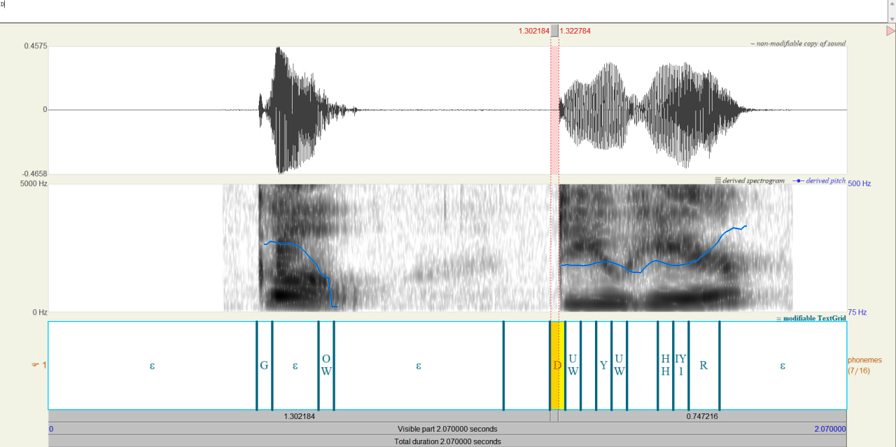
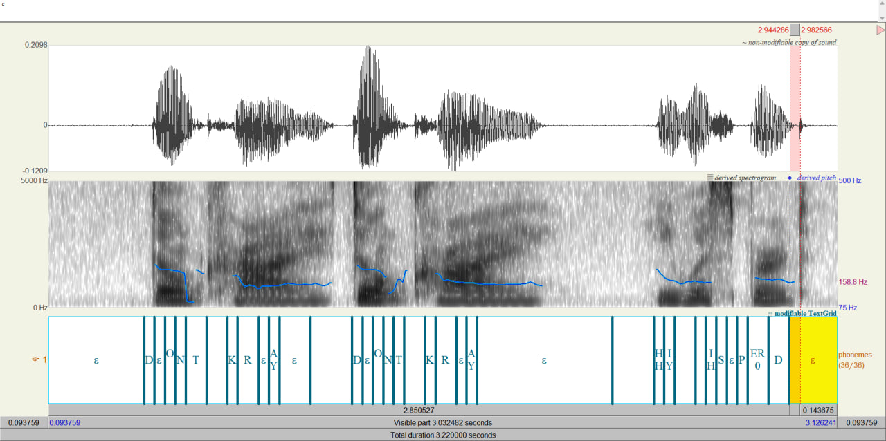
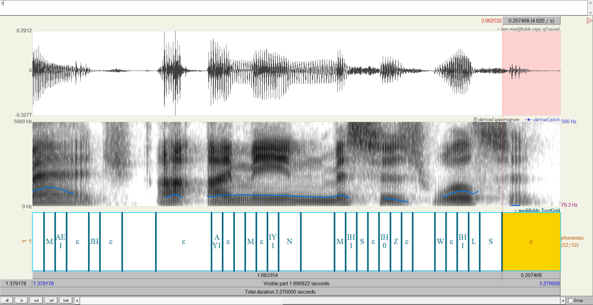
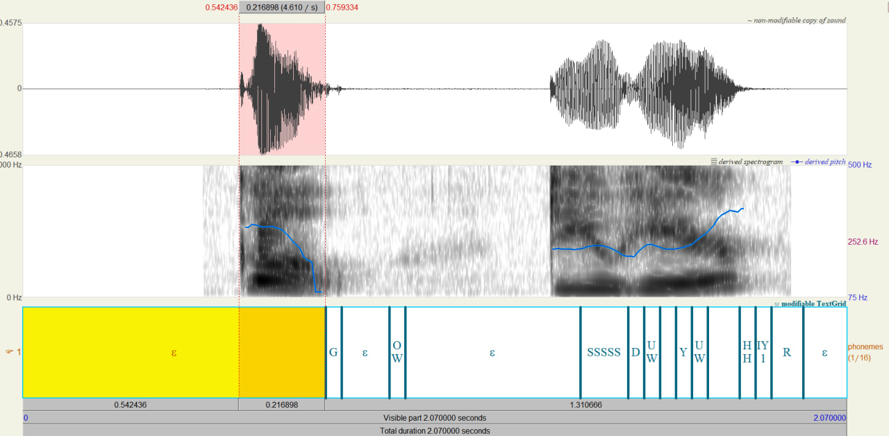
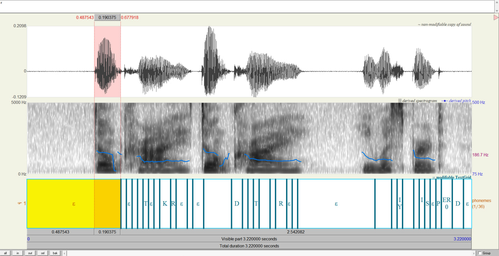
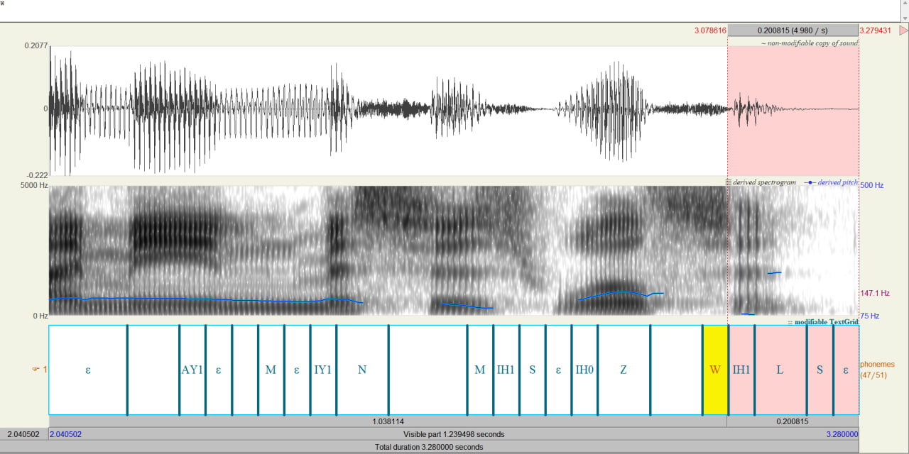

# Alignment Decoding
My task was to decode an audio, from LibriSpeech dec-clean, to text using [provided LSTM acoustic model](https://gist.github.com/proger/a7e820fbfa0181273fdbf2351901d0d8) and check decoding in [Praat software](https://www.fon.hum.uva.nl/praat/)

Code I used to do it is in vivtorok.ipynb

## Results:

I created 2703 textgrids files that store information about phonems and their timings in audio file, some of them were causing problems ending phonems, the model did not decode phonems which were in the end of the audio file

### Using Praat for analysing decoded files:

As we can see we have slight misalignment with the phonem and the actual audio after some time, let's see another example

'Phonem' between silence (ε) and HH does not contain anything, I can't explain why

For this file we have exactly the same situation, this delay in processing after some time happens in every decoding, I believe it's due to the convolutional downsampling, since we have output sample rate in 25 frames per second and input sample rate in 100 frames per second, we can see that deltas of those misalignments are very small ~0.04 seconds 

### Example of a problem with sounds at the end:  

Text: *2428-83699-0013 I EVEN BOUGHT SOMETHING FOR MADGE I MEAN MISSUS WILSON*

We have situation where the last sounds are spoken are not present in textgrid in the last ~0.2 seconds interval, maybe the model can't decode them that fast

## Conclusion:

In my opinion the decoding is accurate, but sometimes we have errors, they often happen when the model meets sound that is very similar to another, or the announcer pronounces it in a different way, in some files we can hear "the" with "d" in the start, not the "ð" sound, and it clearly confuses the model, also the sound durations were accurate with slight misalignments after some time

## Major bug:

When we try to put timings based on models outputs without taking in account it's time to process 'heard' sounds it returns us decoding with delay in ~0.22 seconds for every phonem, below are some examples:

As we can see we have misalignment with the phonem and the actual audio, let's see another example

For this file we have exactly the same situation, this delay in processing happens in every decoding, we have misalignment in about ~0.22 for each example, I believe it's due to the time that model needs to decode the heard sound and maybe convolutional downsampling, since we have output sample rate in 25 frames per second and input sample rate in 100 frames per second

Also if we leave the decoding loop without changing intervals we get an error that suggests us that the start of our last phonem happens when the file itself has ended

### Example of an error happening with audio files:  

Here we have situation where the last sounds are spoken in the last ~0.2 seconds interval, the model can't decode them that fast and tries to put more phonems in the end of decoding, but meets an error that says that the audio file run out and there is no way there can be any more sounds

## Fixing this problem:
At first I fixed the error where the phoneme tries to start when the file has finished using simple try/except blocks, it helped but it couldn't fix the delay in ~0.22 for every file at the start

When the decoding ended and I started analysing the results, I decided to subtract the average delay per file (I've chosen 0.22) from each phoneme start and it fixed both problems, during the decoding cycle no try/except block was called and I got very good alignments for the phonems, at least at the start, then we got the little delays I mentioned earlier

