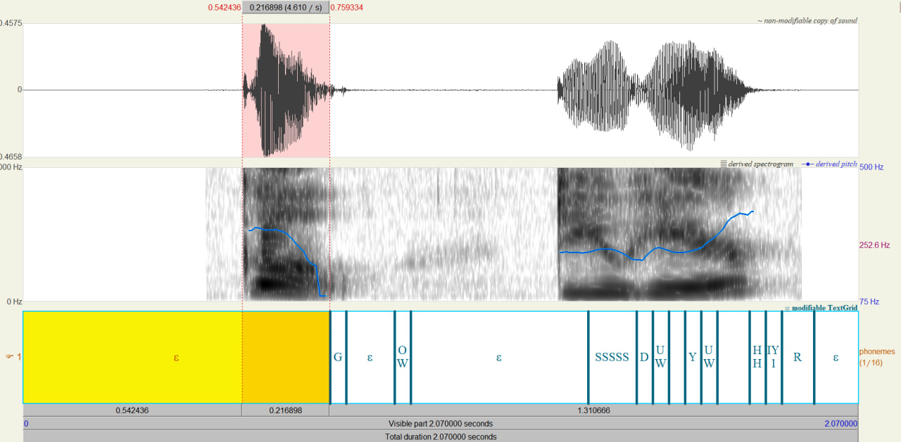
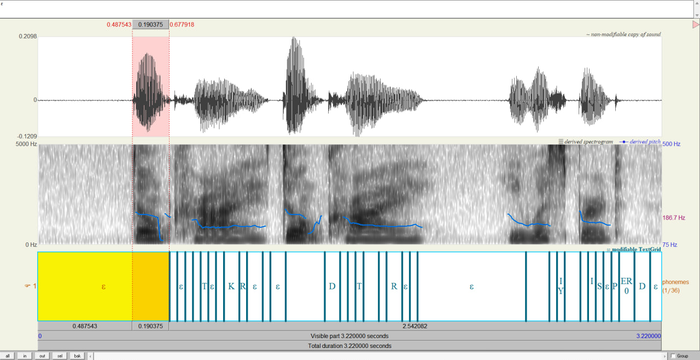
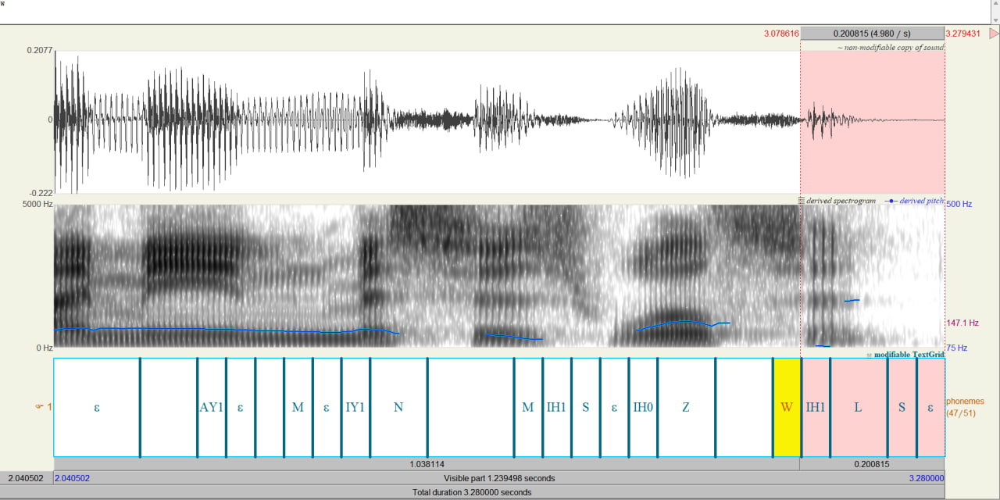

# Alignment Decoding
My task was to decode an audio, from LibriSpeech dec-clean, to text using [provided LSTM acoustic model](https://gist.github.com/proger/a7e820fbfa0181273fdbf2351901d0d8) and check decoding in [Praat software](https://www.fon.hum.uva.nl/praat/)

Code I used to do it is in vivtorok.ipynb

## Results:

I created 2703 textgrids files that store information about phonems and their timings in audio file, some of them were causing problems with intervals, their decoded last phonems were starting when the audio already ended, I fixed this mistake by deleting last added interval so that timing of last decoded phonem syncs with the end of an audio file

### Using Praat for analysing decoded files

As we can see we have misalignment with the phonem and the actual audio, let's see another example

For this file we have exactly the same situation, this delay in processing happens in every decoding, we have misalignment in about ~0.20 for each example, I believe it's due to the time that model needs to decode the heard sound and convolutional downsampling, since we have output sample rate in 25 frames per second and input sample rate in 100 frames per second

### Explanation of an error happening with audio files:  

As I thought, we have situation where the last sounds are spoken in the last ~0.2 seconds interval, the model can't decode them that fast and tries to put more phonems in the end of decoding, but meets an error that says that the audio file run out and there is no way there can be any more sounds

## Conclusion:

In my opinion the decoding is accurate, but sometimes we have errors, they often happen when the model meets sound that is very similar to another, or the announcer pronounces it in a different way, in some files we can hear "the" with "d" in the start, not the "ð" sound, and it clearly confuses the model, also the sound durations were very accurate, if we had taken into account that model has ~0.2 seconds delay we could have very accurate model with almost perfect timings

